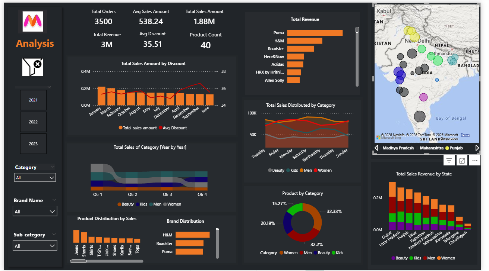

# 📊 Myntra Sales Dashboard – Data Analyst Project

## 📌 Overview
This project presents a complete Sales Analysis Dashboard for Myntra, designed to provide business insights such as revenue trends, product performance, state-wise sales, customer behavior, and discount impacts. The dashboard is built to help business teams make fast, data-driven decisions.

---

## 🎯 Key Objectives
- Analyze total sales, revenue, and product performance  
- Understand category & brand-wise contribution  
- Identify high-performing states  
- Study the relation between discount and sales  
- Provide interactive filters for deeper analysis  

---

## 🛠️ Tools & Technologies
- Power BI for dashboard creation  
- Excel / CSV for data preprocessing  
- DAX Measures for KPIs  
- Data Cleaning & Transformation  

---

## 📂 Dataset Summary
The dataset includes:  
- Product details (Category, Sub-category, Brand)  
- Sales amount, units sold, discounts  
- Date-wise and State-wise sales data  

---

## 📸 Dashboard Preview

---

## 📈 Key Metrics (KPIs)
- Total Orders: **3500**  
- Total Revenue: **3M**  
- Total Sales Amount: **1.88M**  
- Average Sales Amount: **538.24**  
- Average Discount: **35.51**  
- Product Count: **40**  

---

## 📊 Dashboard Insights
- Month-wise Total Sales vs Discount trend  
- Quarter-wise Category performance  
- Brand-wise revenue comparison  
- Daily category sales distribution  
- Product distribution by sales volume  
- Category contribution donut chart  
- State-wise sales map visualization  
- Revenue by category for each state  

---

## 🎛️ Filters Used
- Year (2021, 2022, 2023)  
- Category  
- Brand Name  
- Sub-category  

---

## 📁 Project Structure
Myntra-Sales-Dashboard/  
• data/  
 • myntra_dataset.xlsx  
• dashboard/  
 • myntra_dashboard.pbix  
• images/  
 • dashboard_preview.png  
• README.md  

---

## 🚀 How to Use
1. Download the repository  
2. Open the `.pbix` file in Power BI Desktop  
3. Load/refresh the dataset  
4. Use slicers for filtering  
5. Explore interactive KPIs and charts  

---

## 💡 Future Enhancements
- Add predictive analysis & forecasting  
- Enable automated data refresh using Power BI Gateway  
- Improve customer segmentation  
- Perform discount optimization analysis  

---

## 🙋‍♂️ Author
**Yash Gunudre**  
Data Analyst | IIT Dhanbad  
